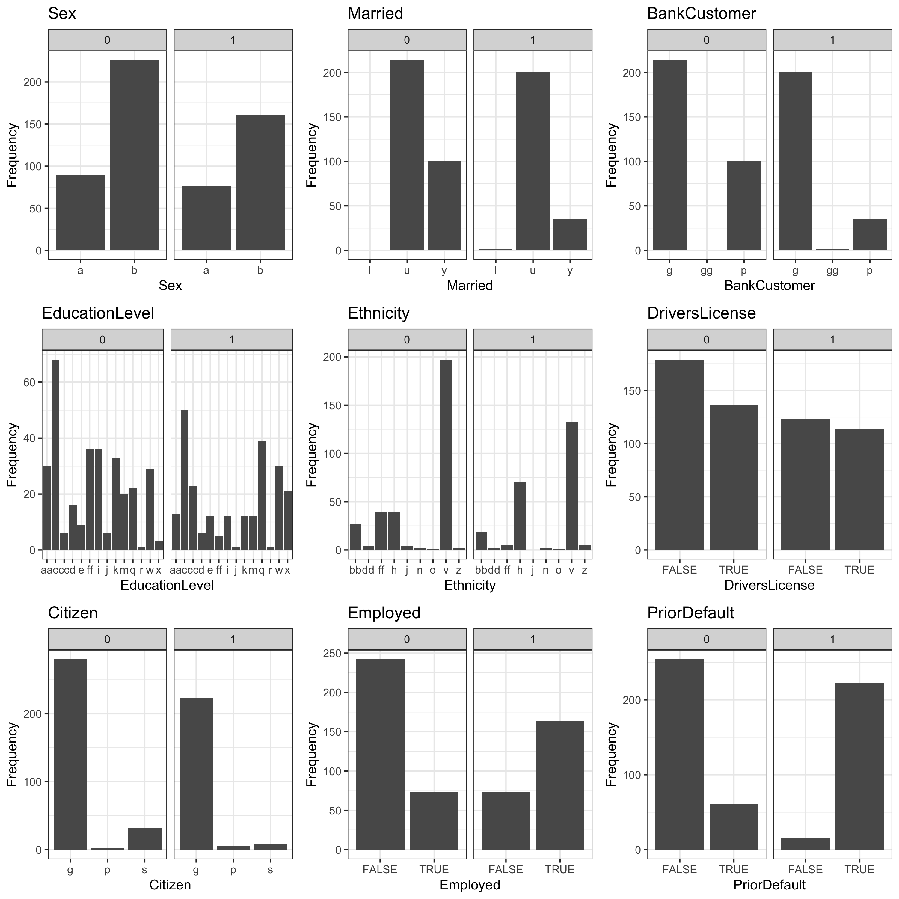
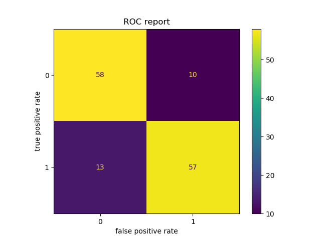

```{r setup, include=FALSE}
knitr::opts_chunk$set(echo = FALSE)
library(knitr)
library(tidyverse)
```

# Summary
In this analysis, we attempted to build a classification model using
decision tree and random forest models to predict whether a credit card
application will be approved or rejected based on applicant’s personal
information. Our final model performs pretty well on the test dataset.
Our final model is Random Forest, and the **test accuracy is 0.81**,
with **test recall = 0.93**, **test auc = 0.92** and **test F1 score = *0.811*. There are **22** false positive cases where applicants were not granted their credit card, but our model predicts that their application was approved. This indicates that there are still limitations on our model, and
this kind of false positive cases could lead to unwanted credit default
issues. Thus, we believe that there are still room for improvement for
our prediction model before it can be launched. 


# Introduction
Credit card approval is an important activity for banks and other
financial institutions. If too few credit cards are issued, profits and
business performance will suffer. On the other hand, if too many credit
cards are issued, the institution could lose money from customer
defaults on payments. Therefore, financial institutions use rigorous
methods to decide whether to approve or deny a customer application. A
model that can accurately predict credit card approval using customer
application information would alleviate the burden of manual inspection
and help financial institutions make more objective decisions.

For this project, we are attempting to answer the following research
question:

1.  Given certain personal features, will the person’s credit card
    application be approved or not?

If we could accurately answer this question, financial insitutions would
be able to provide faster and more accurate credit card approvals, while
requiring less manual review work by employees.

# Methods

## Data

The dataset used in this project is from  UCI [@UCI] data repository, and can be found [here](https://archive.ics.uci.edu/ml/datasets/Credit+Approval), specifically in [this file](https://archive.ics.uci.edu/ml/machine-learning-databases/credit-screening/crx.data). 
Each row of the dataset is an applicant information, including personal information like age, sex, educational level, income, and so on. The last column of the dataset is the target variable, indicating whether the application is approved or not.

**Note:** In order to protect confidentiality of the data, all attribute names and values in the dataset were changed to meaningless symbols. We chose to add feature names to the dataset (shown below) to increase the readability of this report, but these names and values should not be interpreted literally. The feature names (e.g. Age, YearsEmployed) were chosen based on examples from others who have analyzed the same dataset.


## Analysis

### Exploratory Analysis
The dataset contains a nice mix of numerical and categorical features. The below plot shows an analysis of the correlation between our numerical variables and the target variable. 
 
 Figure 1 The correlation between numerical variables and the target variable

**Observations from Figure 1:**

- There is not high collinearity between any pair of predictors
- The dataset is well balanced, with a ~60:40 split between the two prediction classes
- The boxplots show that many of the variables appear useful for predicting the correct class

For categorical variables, we plotted bar plot of each predictor against the target variable.
 
Figure 2 The correlation between categorical variables and the target variable

**Observations from Figure 2:**

- `Employed` and `PriorDefault` appear to be very strong predictors of the response class
- Certain categories in `EducationLevel` and `Ethnicity` are also differentiated between the two classes
- Many others appear less predictive (e.g. `DriversLicense` and `Sex`)
   
### Model Analysis

Since the results our preliminary EDA were inconclusive, at this stage of our project, we decided to focus our efforts in improving the performance of our final model instead of attempting to draw inferences with regards to feature importance. We choose to use xgboost, lgbm and random forest classifier(s) because these models can handle both numerical variables and categorical
variables well. Random forest was used to build a classification model to predict whether a credit card application would be approved or rejected. All variables included in the original data set, were used to fit the model.
The hyperparameter(s) namely no. of estimators, maximum depth and scoring criterion (Gini/Entropy) were chosen using 3 fold stratified cross validation.
The R [@R] and Python [@Python] programming languages, and the following R and Python packages were used to perform this analysis: docopt[@docopt], knitr [@knitr], tidyverse [@tidyverse], Pandas [@mckinney-proc-scipy-2010], and scikit-learn [@pedregosa2011scikit]. The code for this project can be found here: https://github.com/UBC-MDS/DSCI_522_Group_412.

# Results and Discussion

As the first step, we chose to run all three ensemble methods namely, xgboost, lgbm and Random forest on our processed training data. A comparison was done on the basis of train and test accuracy and run time. Random forest outperformed xgboost and lgbm in terms of all three criterion with train accuracy = 0.995 , test accuracy = 0.826 and run time = 0.2259 (sec) (Table 1).
```{r table, echo=FALSE}
df <- read_csv("../results/model_compare.csv")
knitr::kable(df)
```
We obtained a very high value for train accuracy, which could be an indication that our model is overfitting. To tackle this, we performed 3-fold stratified cross validation to perfomr hyperparameter optimisation. At this stage, to assess our model's performance, apart from test and train accuracies we obtained the model's recall, precision, and auc score on the test data. (Table 2).
```{r table, echo=FALSE}
df <- read_csv("../results/accuracy_report.csv")
knitr::kable(df)
```

Our model did well on the test data with auc score of 0.92 and an overall accuracy of 0.81. Though we obtained a high auc score and accuracy, we obtained a low precision (=0.72). This could further be observed from the confusion matrix plot, where we have high number of false positive cases (=22), i.e. predicting rejected application as successful. Given the implications this has for the customers and the banks, this model is not good enough to yet implement in industry.

```{r confusion matrix, echo=FALSE, fig.cap="Figure 1. Confusion matrix for final model. ", out.width = '60%'}

```
To further improve the model's performance in future, we have the following suggestions:
- We observed overfitting (i.e. extremely high training accuracies with and without hyperparamter optimisation). This could be alleviated with more data which would enable us to perform training, validation and testing
- With the task in hand, the 22 misclassified observation(s) need to be aanalysed appropriately. We could compare these to the correct classifications (from both classes) to identify which feature(s) are driving the mis classification. Also, with the help of domain experts, feature engineering could be used to improve the model's precision.


# References