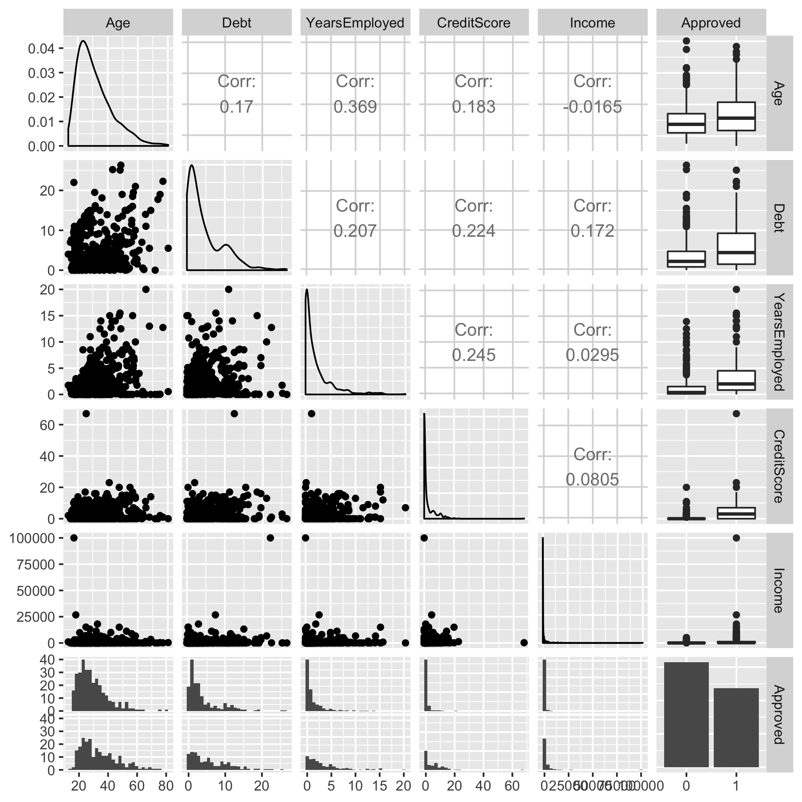

Predicting Credit Card Approval
================

  - [Summary](#summary)
  - [Introduction](#introduction)
  - [Methods](#methods)
      - [Data](#data)
      - [Analysis](#analysis)
          - [Exploratory Analysis](#exploratory-analysis)
          - [Model Analysis](#model-analysis)
  - [Results and Discussion](#results-and-discussion)
  - [References](#references)

# Summary

In this analysis, we attempted to build a classification model using
decision tree and random forest model to predict whether a credit card
application will be approved or rejected based on applicant’s personal
information. We also attempted to identify the important features that
can affect credit card application results. Our final model performs
pretty well on the test dataset. Our final model is **Model**, and the
test accuracy is **Accuracy**, with **Recall**, **Precision**, and **F1
score**. There are **number of false positive** cases. When in reality
these applicants should not be granted their credit card, but our model
predicts that their application should be approved. This shows that
there are still limitations on our model, and this kind of false
positive cases could lead to severe credit default issues. Thus, we
believe that there are still room for improvement for our prediction
model before it can be launched into reality.

# Introduction

Credit card approval has always been an important issue for banks and
other financial institutions. It is hard to balance between profits from
credit cards and credit default rate/risk control. If the institutions
issue too less credit cards, their business performance may be affected.
On the other hand, if the institutions issue too much credit cards,
there could be potential credit bubble and high credit default rate.
Thus, a model that can predict credit card approval will alleviate the
burden of manual inspection and help financial institutions make more
sensible decisions.

For this project, we are attempting to answer two research questions:

1.  How does personal features such as age, marital status, income,
    credit score, debt levels, lead to credit card application status?

2.  Given certain personal features, will the person’s credit card
    application be approved or not?

It is important to answer these two questions since financial
institutions receive numerous personal information when reviewing credit
card applications, and they need to use the information to make informed
decisions.

In addition, as more and more people nowadays apply for credit cards, it
would be a heavy burden for staff members of financial institutions to
review all the applications manually. Hence, if there is a model
performs well on credit card application prediction, those staff members
will be freed from this tedious task and focus on other profit
generating tasks.

# Methods

## Data

The dataset used in this project is from UCI (Dua, D. and Graff, C.
2019) data repository, and can be found
[here](https://archive.ics.uci.edu/ml/datasets/Credit+Approval),
specifically in [this
file](https://archive.ics.uci.edu/ml/machine-learning-databases/credit-screening/crx.data).
Each row of the dataset is an applicant information, including personal
information like age, sex, educational level, income, and so on. The
last column of the dataset is the target variable, indicating whether
the application is approved or not.

## Analysis

### Exploratory Analysis

In the exploratory analysis part, for numerical variables we reviewed
the correlation between numerical variables and the target variable.
 Figure 1 The correlation between
numerical variables and the target variable

For categorical variables, we plotted bar plot of categorical variables
against the target variable. 
Figure 2 The correlation between categorical variables and the target
variable

### Model Analysis

We choose to use decision tree and random forest classifier because
these two models can handle both numerical variables and categorical
variables well. We do not need to perform feature transformation like
one-hot encoding for categorical variables. The decision tree is easy to
interpret. Hence, we may have a better understanding which feature is
more important in predicting credit card approval status. The
**hyperparameter** was chosen using **cross-validation**. The R (R Core
Team 2019) and Python (Van Rossum and Drake 2009) programming languages,
and the following R and Python packages were used to perform this
analysis: docopt(de Jonge 2018), knitr (Xie 2014), tidyverse (Wickham
2017), Pandas (McKinney 2010), and scikit-learn (Pedregosa et al. 2011).
The code for this project can be found here:
<https://github.com/UBC-MDS/DSCI_522_Group_412>.

# Results and Discussion

# References

de Jonge, Edwin. 2018. *Docopt: Command-Line Interface Specification
Language*. <https://CRAN.R-project.org/package=docopt>.

Dua, D. and Graff, C. 2019. *Credit Approval Data Set*. Irvine, CA:
University of California, School of Information; Computer Science: UCI
Machine Learning Repository.
<https://archive.ics.uci.edu/ml/datasets/Credit+Approval>.

McKinney, Wes. 2010. “Data Structures for Statistical Computing in
Python.” In *Proceedings of the 9th Python in Science Conference*,
edited by Stéfan van der Walt and Jarrod Millman, 51–56.

Pedregosa, Fabian, Gaël Varoquaux, Alexandre Gramfort, Vincent Michel,
Bertrand Thirion, Olivier Grisel, Mathieu Blondel, et al. 2011.
“Scikit-Learn: Machine Learning in Python.” *Journal of Machine
Learning Research* 12 (Oct): 2825–30.

R Core Team. 2019. *R: A Language and Environment for Statistical
Computing*. Vienna, Austria: R Foundation for Statistical Computing.
<https://www.R-project.org/>.

Van Rossum, Guido, and Fred L. Drake. 2009. *Python 3 Reference Manual*.
Scotts Valley, CA: CreateSpace.

Wickham, Hadley. 2017. *Tidyverse: Easily Install and Load the
’Tidyverse’*. <https://CRAN.R-project.org/package=tidyverse>.

Xie, Yihui. 2014. “Knitr: A Comprehensive Tool for Reproducible Research
in R.” In *Implementing Reproducible Computational Research*, edited by
Victoria Stodden, Friedrich Leisch, and Roger D. Peng. Chapman;
Hall/CRC. <http://www.crcpress.com/product/isbn/9781466561595>.

